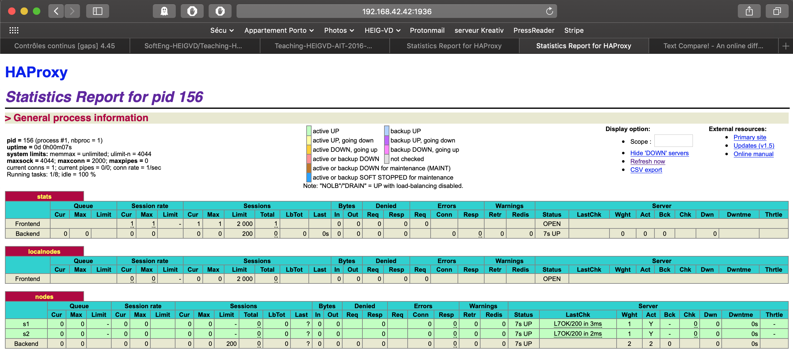
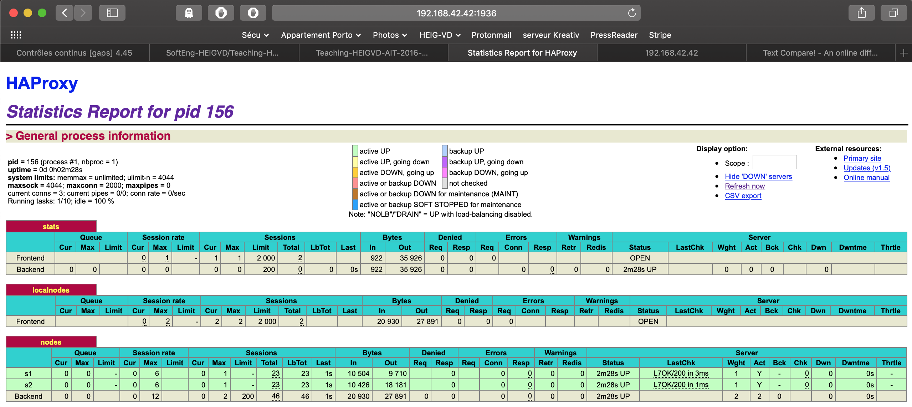

#AIT - Rapport du labo 04 - Docker and Dynamic Scaling 

__Auteur:__ Patrick Neto

__Date:__ 05.01.2019

## Introduction

Dans ce labo, l'objectif est de de découvrir le scaling dynamic, par le biais d'une infrastructure docker. Celui-ci est dans la suite logique du précédent, où nous avions vu comment mettre en place une infrastructure statique.

## Task 0 : Identify issues and install the tools

Voici la réponses aux questions:

[M1] 

Non cette solution n'est pas optimale pour une mise en production. En effet, l'ajout ou la suppression de noeud ne peut pas se faire dynamiquement, sans stoper l'infrastructure.

[M2] 

1) Changer le fichier de configuration du proxy `haproxy.cfg`(y ajouter un noeud avec une ligne de ce type `server <name>:3000 check` )

2) Ajouter une ligne `sed` au fichier `run`, situé dans `/ha/scripts`. 

3) Arrêter les serveurs (y compris le proxy) et les relancer.

[M3]

Il faudrait que la détection d'un nouveau noeud et le changement de configuration du proxy se fasse dynamiquement.

[M4]

On peut utiliser le Serf qui va gérer de manière autonome la grape de serveurs web disponibles.

[M5]

Non, ce n'est pas possible. 

[M6]

La solution actuelle proposée n'est pas dynamique (chaque serveur doit être ajouté manuellement et la configuration du proxy également). La solution est de mettre en place un processus qui va gérer automatiquement ces ajouts, lorsqu'un nouveau serveur est mis en place ou retiré.

___

Pour cette tâche, il est demandé de réaliser les mêmes opérations que pour le précédent labo. Voici les réponses aux questions posées dans cette tâche:

1) Voici la capture d'écran de la page d'accueil du serveur proxy à l'adresse `192.168.42.42:1936`.

2) Voici l'adresse du repo Github du labo: https://github.com/p-stackouse/Teaching-HEIGVD-AIT-2016-Labo-Docker

## Task 1 : Add a process supervisor to run several processes

1) Voicie la capture d'écran de la page d'accueil du serveur proxy:

2) Je n'ai pas eu de difficulté particulière pour la réalisation de cette tâche. Le but du superviseur est de gérer des services tournant dans un container, sans pour autant l'arrêter, lorsqu'ils sont manipulés.

## Task 2 : Add a tool to manage membership in the web server cluster

1) Les logs correspondants aux serveurs `ha` , `s1` et `s2` sont disponibles dans le sous-dossier du repo `/logs/task2/`

2) Le problème est le "linkage" des noeuds au proxy. 

3)

## Task 3 : React to membership changes

1) et 2) Les logs sont disponibles dans le sous-répertoire `logs/task3`.

##Task 4: Use a template engine to easily generate configuration files

1) Chaque appel de RUN crée une couche supplémentaire en mémoire. Par conséquent, si on utilise qu'un seul RUN et on chaîne les instructions (seconde solution), l'image sera d'une taille plus petite en mémoire. 

2) Une solution serait de mutualiser les ressources docker (couches) entre les différents noeuds à disposition du proxy, afin d'éviter de répéter chaque couche quand on crée une image webapp. Pour cela, il faut réorganiser notre fichier Dockerfile (instructions RUN). 

3) Les logs sont disponibles dans le sous-répertoire `logs/task4`.

4) La génération de fichiers ne se fait pas de manière automatisée.

## Task 5: Generate a new load balancer configuration when membership changes

1), 2), 3) tous les logs sont dans le sous-répertoire `logs/task5`.

## Task 6: Make the load balancer automatically reload the new configuration

1) Les logs sont disponibles dans le sous-répertoire `logs/task6`

## Conclusion

Malgré quelques difficultés de mise en place des noeufs, ce laboratoire m'a permis de découvrir une nouvelle facette de docker qui est la mise en place dynamique d'une infrastructure de serveurs.

